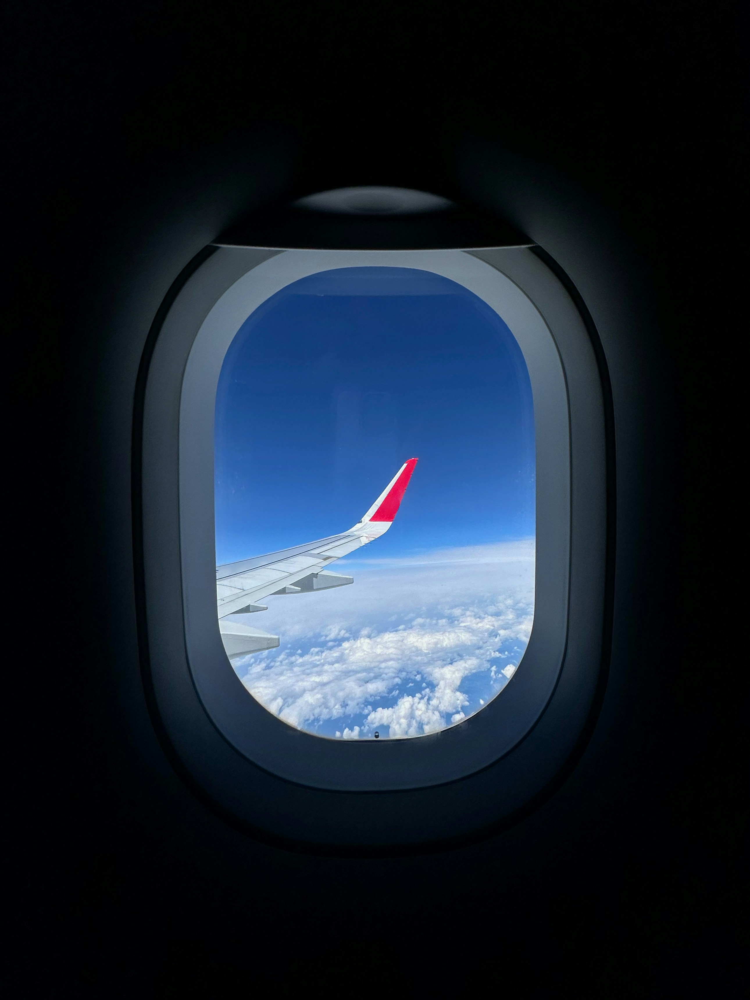
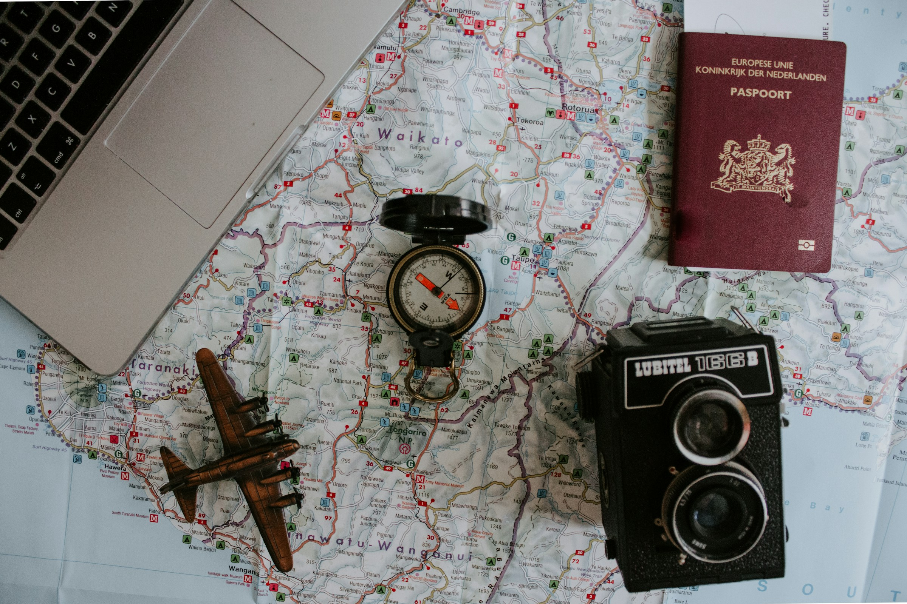

# Contexte : 
L’an dernier, en juin 2024, j’ai eu la chance de partir en Norvège grâce à un circuit organisé par Sabardu Tourisme. Ce séjour de huit jours m’a emmené parcourir 1915 kilomètres entre paysages naturels grandioses, villes pittoresques et découvertes culturelles. J’ai décidé de réaliser trois articles regroupant l’intégralité de cette aventure unique que j’ai eu le privilège de vivre afin de rendre votre lecture plus agréable.

# Jour 1 : Marseille — Francfort — Oslo

Le voyage a commencé très tôt, avec un rendez-vous à Marseille pour un départ en autocar vers l’aéroport. L’accueil chaleureux d’un représentant Sabardu Tourisme nous a immédiatement mis dans l’ambiance. Après les formalités d’enregistrement, nous avons pris un vol via Francfort, pour arriver en fin de journée à Oslo. Notre guide local nous attendait pour un transfert vers l’hôtel, où le calme scandinave nous a tout de suite séduits. Dîner et première nuit dans la région d’Oslo, et nous sommes prêts pour vivre une semaine folle d’aventures.

