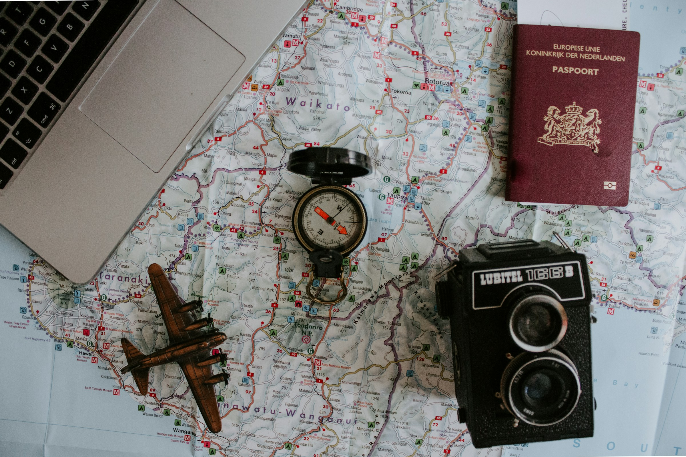

# Contexte : 
L’an dernier, en juin 2024, j’ai eu la chance de partir en Norvège grâce à un circuit organisé par Sabardu Tourisme. Ce séjour de huit jours m’a emmené parcourir 1915 kilomètres entre paysages naturels grandioses, villes pittoresques et découvertes culturelles. J’ai décidé de réaliser trois articles regroupant l’intégralité de cette aventure unique que j’ai eu le privilège de vivre afin de rendre votre lecture plus agréable.

# Jour 1 : Marseille — Francfort — Oslo

Le voyage a commencé très tôt, avec un rendez-vous à Marseille pour un départ en autocar vers l’aéroport. L’accueil chaleureux d’un représentant Sabardu Tourisme nous a immédiatement mis dans l’ambiance. Après les formalités d’enregistrement, nous avons pris un vol via Francfort, pour arriver en fin de journée à Oslo. Notre guide local nous attendait pour un transfert vers l’hôtel, où le calme scandinave nous a tout de suite séduits. Dîner et première nuit dans la région d’Oslo, et nous sommes prêts pour vivre une semaine folle d’aventures.

-

Nous avons également fait connaissance avec notre fidèle destrier qui nous conduira sur la route tout au long de la semaine.

-

# Jour 2 : Oslo — Lillehammer — Gudbrandsdal

Après un copieux petit-déjeuner, la journée a commencé par une route panoramique longeant le lac Mjøsa, le plus grand lac de Norvège, d’un calme impressionnant. À Lillehammer, ville hôte des Jeux Olympiques d’hiver de 1994, nous avons fait un tour d’orientation, puis gravi le sentier jusqu’au pied du célèbre tremplin de saut à ski, symbole sportif de la région.

-

Le déjeuner en ville nous a permis de goûter à la cuisine locale. L’après-midi était consacré à la visite de l’écomusée de Maihaugen, un voyage dans le temps au cœur des traditions et de l’artisanat de la vallée du Gudbrandsdal, réputée aussi pour son fromage brun.

-

Ensuite est venu le temps de visiter le Musée des jeux olympiques, lieu retraçant l’évolution de cette compétition mythique.

-

La soirée s’est déroulée dans cette vallée paisible, où la nature est omniprésente.




  <figure class="figure">
    
    <figcaption>Photo 1</figcaption>
  </figure>
  <figure class="figure">
    
    <figcaption>Photo 2</figcaption>
  </figure>

